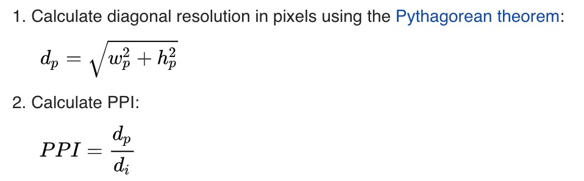

# 4K/1080P/Retina之到底是什么
在选购手机、电脑、电视时候往往会听到这么一些专业词汇：视网膜分辨率、4K屏、PPI等词汇，那么他们到底是啥呢？它们之间又有什么区别与联系呢？

## 4K
* [4K](https://en.wikipedia.org/wiki/4K_resolution)指的是屏幕在**水平**方向上近似有4000个像素点，通常表示分辨率为4K * 2K级别，例如3840 * 2160左右。
* [1080p](https://en.wikipedia.org/wiki/1080p)的分辨率通常为1920 * 1080，也被称为Full HD。1080p指的是屏幕在**竖直**方向上有1080个像素点。当然，按照4K的叫法，我们也可以把1080p叫做**2K**。

可以看出，4K与1080p(2K)的关系非常简单，一个4K屏等价于4个1080p的拼接，如下图所示：

  

> 上图出自于[Wikipedia 4K Resolution](https://en.wikipedia.org/wiki/4K_resolution)

举个栗子，PS4的分辨率为1080P，虽然PS4 Pro的一个卖点就是宣称自己支持4K画面，然而我们翻出它的宣传海报可以看到，PS4 Pro的游戏分辨率大部分为1440p，
还有什么理由不买PS5

## PPI
PPI全称为[Pixels Per Inch](https://en.wikipedia.org/wiki/Pixel_density)，即单位英寸内的像素，用来衡量像素密度。可以这么理解，如果屏幕的ppi越高，那么它的像素密度越大，因此它越清晰。很多情况下，我们不能单纯使用像素来衡量屏幕的清晰程度，这是因为不同屏幕的大小不同，但是采用ppi，就能抹去屏幕大小因素，直接比较屏幕的清晰度。

* PPI计算
  - 理论上，PPI可以根据屏幕的尺寸大小和屏幕像素计算而来，屏幕尺寸与ppi都以对角线来计算，其计算公式是：
  
  - 其中：
    - dp是对角线像素
    - wp是宽边像素
    - hp是高边像素
    - di是对角线英寸，即屏幕英寸大小
* 举个栗子
  - 以65寸的4K屏为例：
  - 

## Retina Resolution
这就是传说中的[视网膜分辨率](https://en.wikipedia.org/wiki/Retina_display#cite_note-npr_info_1-1)了。该次出自于苹果公司，用来代表着超高分辨率屏幕。之所以叫做视网膜分辨率，是指在这种像素下，人类肉眼已经无法分辨出单独像素了。
> "Retina displays have a pixel density that's so high, your eyes can't discern individual pixels at a normal viewing distance. This gives content incredible detail and dramatically improves your viewing experience."

在iPhone4发布会上，乔老爷说过：
> "The number of pixels needed for a Retina display is about 300 PPI for a device held 10 to 12 inches from the eye."

也就是说，在屏幕距离眼睛10到12英寸的范围内，视网膜屏的PPI大概在300左右。同时，也给出了Retina的设计标准公式：

  

其中：
- PPI为上述所描述的单位像素值
- d为肉眼与屏幕的距离，单位为英寸
- alpha为人眼视角，取1‘ = (1/60)°

根据上述公式，我们可以根据屏幕单位像素PPI求出视网膜级别的观看距离。
举个栗子：
> 65英寸4K电视的Retina观看距离是多少呢？
* 首先求出65英寸4K电视的PPI为67.8
* 带入公式：
* 求出d=50英寸，约为1.27米。
也就是说，在1.27米之外，肉眼已经无法分辨出65寸4K电视的单独像素了！